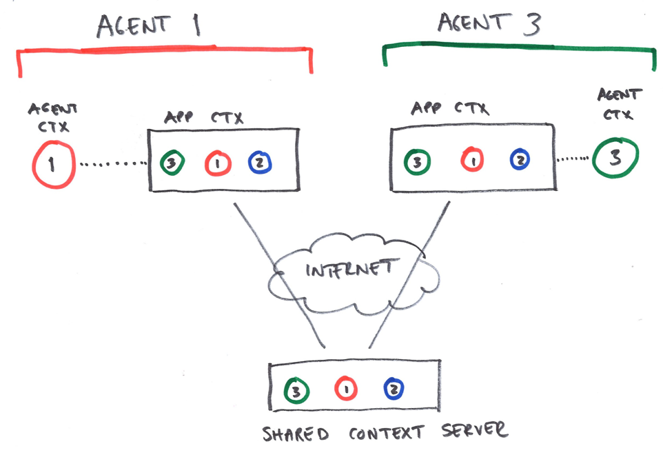

##Shared Context


### Navigation
[Introduction][] | [Agent context][] | [Application context][] | [Shared Context API][]  | [Initialising AppContext and AgentContext][]  | [Components][]  | [Loading Components and Advertising Capabilities][]  | [Discovering Capabilities][]  | [Subscribing to Capabilities][]  | [Interacting with Capabilities][]  | [Dynamic App Context][]  | [Global variables][]  | [Implementing Custom Components][]  | [Turning Components On and Off][]
###Introduction
####Agent context
The agent context provides information about the current agent, it’s capabilities and provides events (as well as sensor management)
####Application context
The application context represents an execution of a multidevice application, contributed by the participating agents. It can be shared between multiple devices of a single user or multiple users, whatever is suitable for the application.




The above figure illustrates the difference between Agent Context (circle) and App Context (rectangle). Agent 1 (RED) and agent 3 (GREEN) each have their own agent context. Some subset of this information is then made public through the AppContext. The AppContext provides representations for all participating agents, including self. (For Agent 1, agentContext.self points to the red circle within the rectangular AppContext.)  

When viewed from a practical angle, it is easy to appreciate the distinction between AgentContext and AppContext.self. For instance, consider the case where Agent1 wants to listen to samples from its own accelerometer. The trivial way to achieve this is to register an event handler on the AgentContext. This should provide high frequency samples with low latency. Alternatively, it is possible to register the handler on AppContext.self. Since this involves propagation of samples over the Internet, it would likely give higher latency (1 RTT), and possibly lower-frequency (as it may be advisable to reduce the frequency for distributed propagation). On the other hand, the output would be consistent with the view of other agents.  


###Shared Context API
This documents the main steps in using the shared state mechanism; how capabilities are advertised, how capabilities can be subscribed to, and how events are propagated and received. Again, we consider an example of sharing accelerometer samples within a multi-device application.  

####Initialising AppContext and AgentContext
```js
var appContext = mediascape.applicationContext(url, options);
```
AppContext is initialised by providing a URL to the shared state server. The constructor creates a singleton object. Token is used for authentication and access control. Options is a dictionary. If not {“agentid”:string} is given, a random ID is used (will be generated every time). The option {autocleanup:true} can be used to automatically clean up old nodes.  

References to appContext and agentContext may be obtained as follows:
```js
var appContext = mediascape.applicationContext;  
var agentContext = mediascape.agentContext(); // agent's own agent context (private)  
var agents = appContext.getAgents(); // all agents in AppContext (including self)  
var selfContext = agents.self; // agent's own agent context (shared)  
```
Agents is a map of agentContext objects, indexed by agentID.

####Components
App Context and Agents Context is implemented by Components. Components are identified by a name, e.g. ‘videoplayer’ or ‘accelerometer’. The purpose of components is simply to provide a namespace and logical separation between independent parts of the context.  
 * Components implement and advertise their capabilities.  
 * Components can be queried for status information  
 * Components encapsulate complexity with subscriptions and events  
 * A set of ready-to-use Components is provided for common sources of context information.  
 * New components may be implemented and loaded   

####Loading Components and Advertising Capabilities
```js
agentContext.setCapability(capability, value);
```
Add or set a capability for this agent.  E.g. setCapability(“audio”, “supported”), setCapability(“location”, [“fine”, “coarse”]).    
Components need to advertise their capabilities. This is performed automatically by the component itself, so it is not something that the programmer has to worry about (except when programming a new component).  

However, the programmer needs to decide which components to load. Loading does not imply any use of a component, but sets it up so that it can be used. For instance, secondary device application for broadcast might want smart phones to load the accelerometer, so that the HTML-infographics overlayed on the smart TV can make use of it for personalised control.  
```js
agentContext.load(component);
```
Component is a JavaScript object implementing a specific interface. We describe this interface below in the section about Implementation of Custom Components. The programmer should not have to know this interface in order to load a predefined component. For predefined components provided by MediaScape we imagine that these components are readily available within the MediaScape namespace.  


####Discovering Capabilities
The programmer may need to figure out which capabilities are provided by the agent.
```js
agentContext.capabilities();
```
Returns a list of all capabilities provided by this agent. (Union of all capabilities provided by all components of this agent.)  
NOTE: Capabilities are shared by default, so any agent can query its AppContext (locally) to discover remote providers of particular capabilities.  

####Subscribing to Capabilities
If an agent wants to interact with a capability, the agents needs to subscribe to that capability. For instance, below we subscribe to the capability “geolocation”.  
```js
agentContext.on("geolocation", func, options);
agentContext.off("geolocation", func);
```
The on() and off() functions register event handlers for the given context parameter. Options is a dictionary (associative array) or null (depending on particulars for the component in question).  For instance, options for geolocation could be something like {“quality”:”precise”} or similar.    
Subscribing to capabilities is a simple local operation. However, much happens behind the scenes. The subscription is shared and persisted via shared context. As the agent that provides this capability (subscribee) is notified of the new subscription, it registres the subscription locally. If this is the first subscription for the component, underlying sensors may have to be started. Similarly, as the last subscriber un-subscribes, the sensor will be shut down.  
NOTE: This approach is also known as upstream subscriptions. Upstream subscription avoid wasting bandwidth for events that no-one subscribes to. A second benefit of this approach is that power-consumption is kept at a minimum as sensors do not have to be started until demand is explicit.  
NOTE: Since subscriptions are persisted through shared state, the subscription may survive a short period after an agent disconnects. This implies that subscription will survive a reload or a short outage. However, if an agent has been disconnected for a while, the subscription will eventually be invalidated.    


####Interacting with Capabilities
Once a subscription has been registered for a capability, the subscribing agent can interact with that capability locally. The capability essentially becomes shared state, so the subscriber can receive events (through the provided event handler), or simply query the state of the capability.  
```js
agentContext.setItem(key, value);
agentContext.getItem(key);
agentContext.keys(); // list of defined keys
agentContext.on(event, function(key, val) {...});
agentContext.off(event, func);
```

####Dynamic App Context
App Context must adapt dynamically as agents connect and disconnect. Agents may also change dynamically by advertising new capabilities, or by revoking capabilities. The “agentchange” event on App Context provide such notifications.  
```js
appContext.on("agentchange", func(e) {e.agentid; e.agentContext));
```
Agentchange is called when an agent appears, or when the meta data about an agent changes (e.g. added a capability). If agentContext is set to null, the agent is offline.  


####Global variables
The shared context mechanism is designed to support representation of fairly advanced instruments and sensors. However, sometimes all that is needed is just a global variable to be part of shared context. If so, there is no need to create a component for that. Instead, by virtue of being layered on top of shared state, shared context supports the same api for setting and getting global variables.   
```js
appContext.setItem(key, value);
var item = appContext.getItem(key);
var keys = appContext.keys(); // list of defined keys
appContext.on(event, function(key, val) {...});
appContext.off(event, func);
appContext.events(); // list of defined events
```
Set a shared parameter for the entire application. Value can be a string or an object.  This is basically a global variable, writeable for all and is not connected to any particular agent.  Example use could be “mode” set to “testing”, “demo”, “production”, “mute”:false etc.  


###Implementing Custom Components
The following example indicates how to implement a simple component that provides the capability “counter”. Essentially the component provides a single value that changes from time to time. The component allows other agents to monitor this value.  
```js
agentContext.load(component);
var component = {
   "counter": { 
      init: function() {
        // this is set to the agentContext.
        this.setCapability("counter", "supported");
      },
      on:function() {
        // this is set to the agentContext.
        // Called when the "instrument" should be turned on
      },
      off: function() {
        // this is set to the agentContext.
        // Called when the instrument should be turned off
      },
     val: "somevalue" // optional initial value
     {
     …
     }
}
```

Load a component. The api functions are optional.  


####Turning Components On and Off
When a capability receives its first subscriber, the underlying component is automatically turned on. Similarly, when the last subscriber disappears, the component turns itself off.   
Additionally, the shared context mechanism provides a hook into the process that turns components on. This allows the programmer to control just how the component is turned on. For instance, in the case of the GPS it may be necessary to require the end-user to confirm access to the component.  
```js
agentContext.setRequestHandler(func(parameter, agentid) { return false;});
```
When an agent registers an event handler to a capability, the request handler function is called. This can trigger user interaction (“Agent … wants to turn on your GPS. Ok, Deny -> true, false).  
Example:
```js
var myContext = agentContext();
var appContext = appContext(url, …);

appContext.self.on("volume", function(val) {video.volume = val});
appContext.on("mute", function (val) { video.mute = val});

var agents = appContext.agents();
var numAgents = agents.length();
…
```
This small example shows an application where video can be muted via a global variable. In contrast, volume levels are shared per agent, so each agent has its own volume setting. Agents can monitor and control each others volume settings. The number of participating agents is available at any time simply by counting the list of agents.

[Introduction]: #introduction
[Agent context]: #agent-context
[Application context]: #application-context
[Shared Context API]: #shared-context-api
[Initialising AppContext and AgentContext]: #initialising-appcontext-and-agentcontext
[Components]: #components
[Loading Components and Advertising Capabilities]: #loading-components-and-advertising-capabilities
[Discovering Capabilities]: #discovering-capabilities
[Subscribing to Capabilities]: #subscribing-to-capabilities
[Interacting with Capabilities]: #interacting-with-capabilities
[Dynamic App Context]: #dynamic-app-context
[Global variables]: #global-variables
[Implementing Custom Components]: #implementing-custom-components
[Turning Components On and Off]: #turning-components-on-and-off